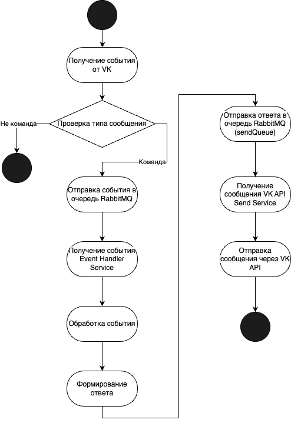
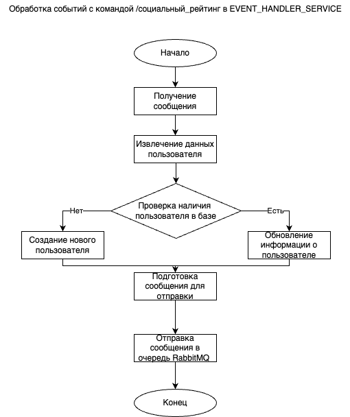
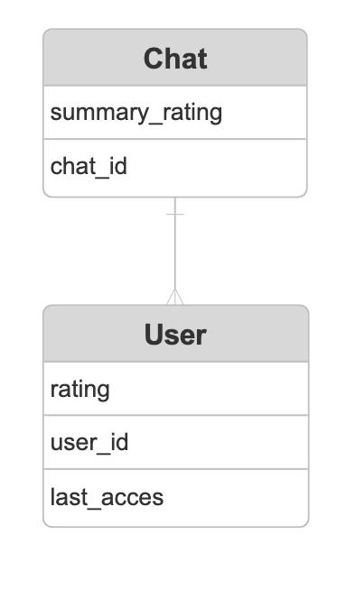
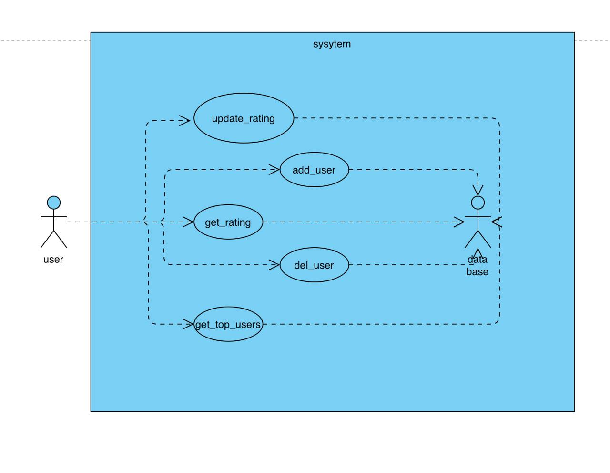
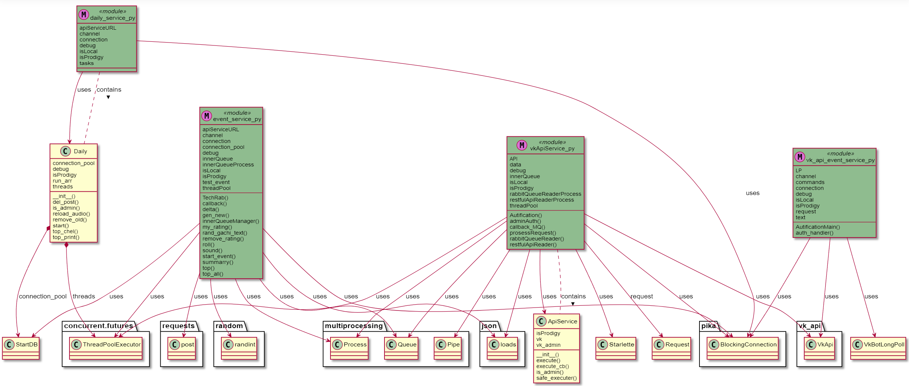

# Проект "Социальный рейтинг"

Подготовили:
 - Софронов Александр Б21-525
 - Гайдук Сергей Б21-525
 - Боголюбов Виталий Б21-525

# Описание архитектуры

## Диаграмма активностей

## Блок схема "Обработка событий с командой /социальный рейтинг в EVENT_HANDLER_SERVICE"

## ERD

## Диаграмма вариантов использования

## Диаграмма классов

## Инструкция по развёртыванию
- git clone
- cd social_rating
- change .env:
 - DEBUG (1 or 0): для дебаг режима (в выделенном чате запускаются все команды, пользователи на любуют команду получают сообщение о технических работах.)
 - PRODIGY (1 or 0): для запуска dev версии по dev токенам
 - LOCAL (1 or 0): Установливает развёрнута СУБД на том же сервере или удалённо
- docker compose up -d (для запуска прод. версии)
- docker compose -f docker-compose-dev.yaml up -d (для запуска dev. версии)
